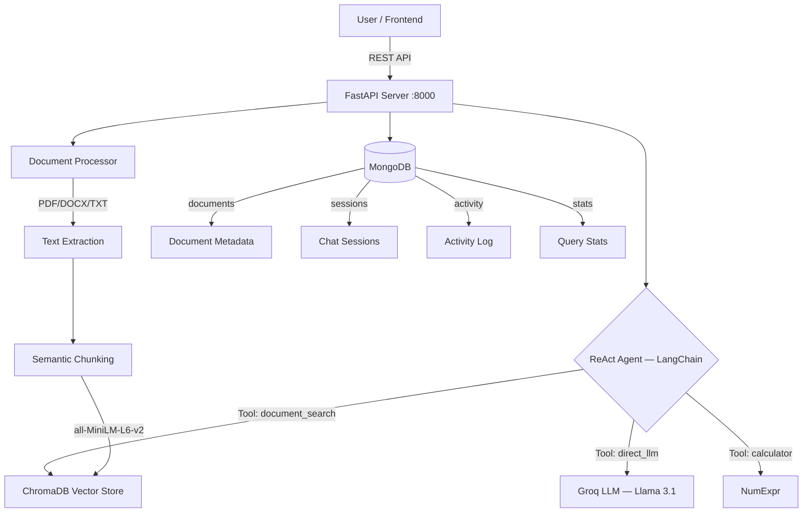

# GenAI Agentic RAG System — Backend

A Python-based GenAI system with agentic RAG capabilities, built with **FastAPI**, **LangChain**, **Groq**, **ChromaDB**, and **MongoDB**.

---

## Architecture



### How it works (plain English)

1. **You upload a file** (PDF, DOCX, TXT) → backend extracts text, splits it into chunks, and stores those chunks in ChromaDB (a vector database). ChromaDB auto-embeds each chunk using a local model (`all-MiniLM-L6-v2`) — no external API needed for this step.

2. **You ask a question** → the ReAct agent (powered by Groq's Llama model) **thinks** about your question, **decides** whether to search your documents or just answer from its own knowledge, **executes** that tool, **observes** the result, and returns a final answer with sources and a full reasoning trace.

3. **Multi-turn chat** → each conversation is stored as a session in MongoDB. The agent sees previous messages so it can follow up intelligently.

---

## Agent Decision Flow

```
User Query
    ↓
[THOUGHT]  Agent analyzes the query and decides a strategy
    ↓
[ACTION]   → document_search (RAG)
           → direct_llm (internal knowledge)
           → calculator (math)
           → combined (search + LLM)
    ↓
[OBSERVATION]  Agent evaluates tool results
    ↓
[CONCLUSION]   Synthesize final answer with citations
    ↓
Return: { answer, sources[], reasoning_trace[], retrieval_used }
```

---

## Tech Stack

| Layer | Technology | Why |
|-------|-----------|-----|
| **Web framework** | FastAPI | Async, auto-docs, Pydantic validation |
| **LLM** | Groq (Llama 3.1 8B) | Free tier, blazing fast inference |
| **Agent framework** | LangChain | ReAct pattern, tool calling |
| **Vector DB** | ChromaDB | Local, no API key, cosine similarity |
| **Embeddings** | all-MiniLM-L6-v2 | Built into ChromaDB, runs locally |
| **Database** | MongoDB (Motor) | Async, flexible schema for sessions/docs |
| **Doc parsing** | pypdf, python-docx | PDF + DOCX + TXT support |

---

## Setup Instructions

### Prerequisites

- **Python 3.11+**
- **MongoDB** running locally (or via Docker)
- **Groq API key** (free at https://console.groq.com)

### Step 1 — Clone & enter the project

```bash
cd backend
```

### Step 2 — Create virtual environment & install dependencies

```bash
python3 -m venv venv
source venv/bin/activate        # macOS/Linux
# venv\Scripts\activate         # Windows
pip install -r requirements.txt
```

### Step 3 — Configure environment variables

```bash
cp .env.example .env
```

Open `.env` and paste your **Groq API key**:

```
GROQ_API_KEY=gsk_your-groq-api-key-here
```

### Step 4 — Start MongoDB

```bash
# Option A: If MongoDB is installed locally
mongod

# Option B: Via Docker (one-liner)
docker run -d -p 27017:27017 --name rag_mongo mongo:7
```

### Step 5 — Run the server

```bash
python run.py
```

- Server starts at **http://localhost:8000**
- Interactive API docs at **http://localhost:8000/docs**

### Step 6 (optional) — Docker Compose (full stack)

```bash
docker-compose up --build
```

---

## API Endpoints

| Endpoint | Method | Description |
|----------|--------|-------------|
| `/api/upload` | `POST` | Upload file → chunk → embed → store in vector DB |
| `/api/query` | `POST` | Ask question → agent decides strategy → cited answer |
| `/api/chat` | `POST` | Multi-turn conversation with session ID |
| `/api/documents` | `GET` | List all uploaded documents with metadata |
| `/api/documents/{id}` | `DELETE` | Delete a specific document + its chunks |
| `/api/sessions` | `GET` | List all chat sessions |
| `/api/sessions/{id}` | `GET` | Get a session's full message history |
| `/api/sessions/{id}` | `DELETE` | Delete a session |
| `/api/dashboard/stats` | `GET` | Dashboard statistics, activity log, agent distribution |
| `/api/clear` | `DELETE` | Clear vector DB + reset all sessions/documents |
| `/api/health` | `GET` | Health check |

---

## Sample API Requests & Responses

### Upload a Document

```bash
curl -X POST http://localhost:8000/api/upload \
  -F "file=@research_paper.pdf"
```

```json
{
  "status": "success",
  "document_id": "doc_abc123def456",
  "filename": "research_paper.pdf",
  "chunks_created": 24,
  "embedding_model": "all-MiniLM-L6-v2"
}
```

### Query (Single Question)

```bash
curl -X POST http://localhost:8000/api/query \
  -H "Content-Type: application/json" \
  -d '{"question": "What is transformer architecture?"}'
```

```json
{
  "answer": "Transformer architecture is based on self-attention mechanisms...",
  "sources": [
    {"document": "research_paper.pdf", "page": 12, "chunk": "The Transformer model relies..."}
  ],
  "reasoning_trace": [
    {"step": 1, "type": "thought", "content": "Checking documents for transformer info..."},
    {"step": 2, "type": "action", "content": "document_search('transformer architecture')"},
    {"step": 3, "type": "observation", "content": "Found 3 relevant chunks (0.89, 0.85, 0.82)"},
    {"step": 4, "type": "conclusion", "content": "Answer uses document retrieval."}
  ],
  "retrieval_used": true
}
```

### Multi-turn Chat

```bash
curl -X POST http://localhost:8000/api/chat \
  -H "Content-Type: application/json" \
  -d '{"session_id": "sess_abc123", "message": "Tell me more about attention"}'
```

```json
{
  "session_id": "sess_abc123",
  "answer": "Building on our previous discussion...",
  "sources": [],
  "reasoning_trace": [...],
  "retrieval_used": false,
  "turn": 3
}
```

### List Documents

```bash
curl http://localhost:8000/api/documents
```

```json
{
  "documents": [
    {
      "id": "doc_abc123",
      "filename": "research_paper.pdf",
      "file_type": "PDF",
      "file_size": "2.4 MB",
      "chunks_count": 24,
      "uploaded_at": "2026-02-26 10:30",
      "embedding_model": "all-MiniLM-L6-v2"
    }
  ],
  "total": 1
}
```

### Clear All Data

```bash
curl -X DELETE http://localhost:8000/api/clear
```

```json
{
  "status": "success",
  "cleared": {"documents": 4, "chunks": 90, "sessions": 3}
}
```

---

## Project Structure

```
backend/
├── app/
│   ├── __init__.py
│   ├── main.py                    # FastAPI app, CORS, lifespan, router registration
│   ├── config.py                  # Pydantic settings — reads .env securely
│   ├── database.py                # MongoDB async connection via Motor
│   ├── models/
│   │   ├── __init__.py
│   │   └── schemas.py             # All Pydantic request/response models
│   ├── routes/
│   │   ├── __init__.py
│   │   ├── documents.py           # POST /upload, GET /documents, DELETE /documents/{id}
│   │   ├── query.py               # POST /query, POST /chat, GET/DELETE /sessions
│   │   ├── dashboard.py           # GET /dashboard/stats
│   │   └── clear.py               # DELETE /clear
│   └── services/
│       ├── __init__.py
│       ├── agent.py               # LangChain ReAct agent + Groq LLM + tools
│       ├── document_processor.py  # PDF/DOCX/TXT parsing + semantic chunking
│       └── vector_store.py        # ChromaDB operations (auto-embeds locally)
├── requirements.txt
├── .env.example
├── .env                           # Your actual secrets (git-ignored)
├── Dockerfile
├── docker-compose.yml
├── run.py                         # Entry point: uvicorn runner
├── support.md                     # Manual build-along guide (backend only)
└── README.md
```

---

## Key Design Decisions

| Decision | Rationale |
|----------|-----------|
| **Groq LLM** | Free tier, extremely fast inference (~200 tokens/sec), OpenAI-compatible |
| **ChromaDB built-in embeddings** | No API key needed for embeddings — `all-MiniLM-L6-v2` runs locally inside ChromaDB |
| **LangChain ReAct pattern** | Thought → Action → Observation → Conclusion gives transparent reasoning traces |
| **MongoDB via Motor** | Async driver, flexible schema for documents/sessions/activity/stats |
| **Pydantic Settings** | `.env` file loaded securely — API keys never hardcoded |
| **Semantic chunking** | `RecursiveCharacterTextSplitter` with configurable chunk size/overlap |
| **Modular routes** | Each route file handles one concern (documents, queries, dashboard, clear) |
